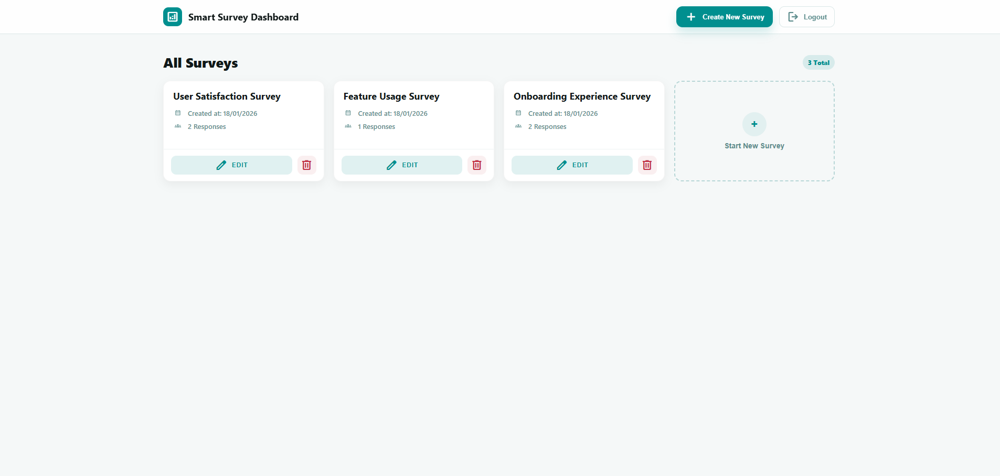
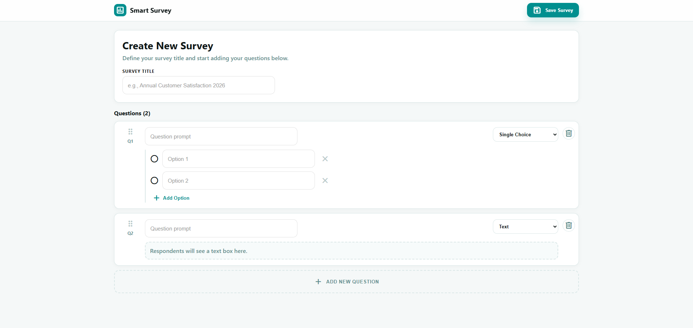
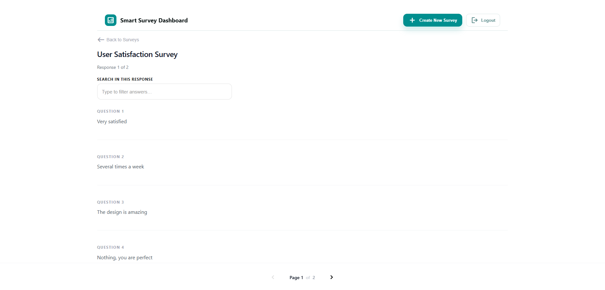

# 🛠️ Survey Admin Panel

A React-based admin panel for managing surveys used by the **Smart Survey SDK**.  
After registering, each developer receives a personal **API Key** that is used to initialize the SDK inside their Android app.

🌐 Live Admin Panel: **https://survey-admin-panel.onrender.com**  
🔗 Backend Server (API): **https://survey-sdk-server.onrender.com**

With this panel you can:

- Create and manage surveys
- View end-user responses submitted from mobile apps
- Copy your personal API Key to use in the SDK initialization

---

## ✨ Features

- ✅ **Authentication (JWT-based)**  
  Developers must login to access protected pages and send requests to the backend.

- ✅ **Developer Registration + API Key**  
  After signing up, the panel displays your personal **API Key**.

- ✅ **Survey Management (CRUD)**
  - Create new surveys
  - Edit existing surveys
  - Delete surveys
  - View all your surveys in a dashboard

- ✅ **Responses Viewer**
  - View all responses for a specific survey
  - Search/filter responses (client-side)

---

## 📦 Installation

### Requirements

- Node.js **v22.17.0**
- npm **11.4.2**
- React **19.2.3**
- react-dom **19.2.3**
- react-router-dom **7.12.0**
- react-scripts (CRA) **5.0.1**

### Prerequisites

- Node.js (LTS recommended)
- npm (comes with Node.js)

### Install dependencies

```bash
npm install
```

### Configure environment variables

Create a file named **`.env`** in the project root:

```env
REACT_APP_API_BASE_URL=https://survey-sdk-server.onrender.com
```

> `REACT_APP_API_BASE_URL` is the base URL of the backend server (the Survey SDK server).

### Run locally

```bash
npm start
```

The app will be available at:

- `http://localhost:3000`

---

## 🚀 Usage

### Register and get your API Key

1. Open the Admin Panel: **https://survey-admin-panel.onrender.com**
2. Go to **Register**
3. Create an account (email + password)
4. After successful registration, the panel shows your **API Key**

You will use this API Key inside the Android SDK:

```kotlin
SmartSurvey.init(
    context = applicationContext,
    baseUrl = "https://survey-sdk-server.onrender.com/",
    apiKey = "YOUR_API_KEY_FROM_ADMIN_PANEL"
)
```

---

### Login

- Login returns a **JWT token**
- The panel stores the JWT in `localStorage`
- All admin requests include:
  - `Authorization: Bearer <JWT>`

---

### Main pages (routes)

| Page             | Route                          | Description                      |
| ---------------- | ------------------------------ | -------------------------------- |
| Login            | `/`                            | Developer login                  |
| Register         | `/register`                    | Create account + receive API key |
| Dashboard        | `/dashboard`                   | View all surveys                 |
| Create Survey    | `/surveys/new`                 | Create a new survey              |
| Edit Survey      | `/surveys/:surveyId/edit`      | Update an existing survey        |
| Survey Responses | `/surveys/:surveyId/responses` | View responses for a survey      |

---

### Survey structure

A survey contains:

- `title`
- `questions[]`

Each question includes:

- `type` (e.g. `TEXT`, `SINGLE_CHOICE`)
- `prompt`
- `options[]` (only for `SINGLE_CHOICE`)

---

## 🖼️ Screenshots

### Dashboard (All Surveys)



### Create Survey



### Survey Responses



---

## 🧩 API Endpoints Used (Frontend → Backend)

Authentication:

- `POST /api/auth/register`
- `POST /api/auth/login`

Surveys:

- `GET /api/admin/surveys`
- `POST /api/admin/surveys`
- `GET /api/admin/surveys/:surveyId`
- `PUT /api/admin/surveys/:surveyId`
- `DELETE /api/admin/surveys/:surveyId`

Responses:

- `GET /api/admin/surveys/:surveyId/responses`

---

## 🛠️ Technology

- **React** (Create React App)
- **React Router**
- **Fetch API** (HTTP requests)
- **JWT Authentication**
- **CSS** (custom styling)

---

## 👨‍💻 Author

Developed by **Tomer Levy**
